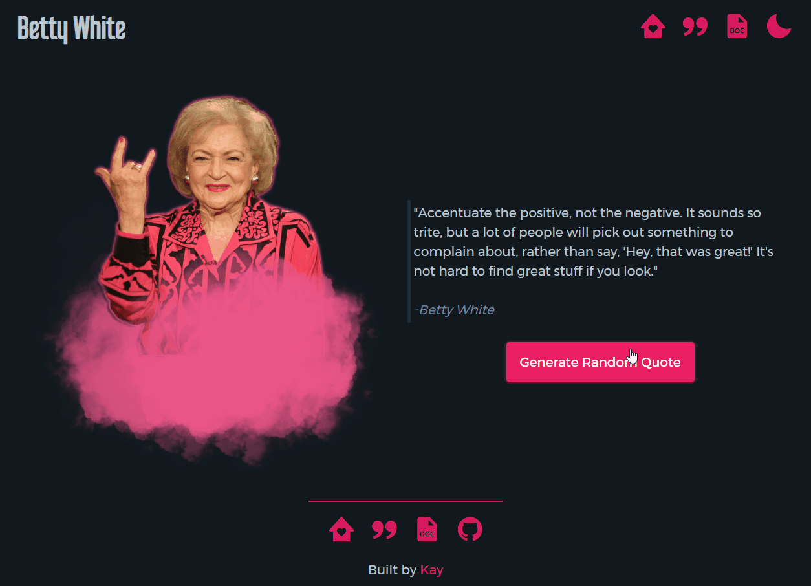

# Betty White Quotes API


Betty White Quotes API, as the name suggests, is an API that provides provides a collection of memorable quotes from the beloved actress and comedian Betty White. With our API, you can easily access and integrate these quotes into your own projects or applications. This API was built for the [#10DayWebBuild](https://10daywebbuild.netlify.app/) Twitter challenge.
## Demo

<p align="center" width="100%">
    
</p>

## Link to Project

[Live Preview](https://bettywhite.cyclic.app/)
## Tech Stack

**Client:** HTML, Javascript, PicoCSS

**Server:** Node.js, Express.js


## Features

- Light/dark mode toggle
- Live preview quote generator


## Documentation

[Complete documentation on website](https://bettywhite.cyclic.app/docs)


## API Reference

#### Get random quote

```bash
  GET /api/random
```

#### Get quote by id

```bash
  GET /api/${id}
```

| Parameter | Type     | Description                       |
| :-------- | :------- | :-------------------------------- |
| `id`      | `string` | **Required**. Id of item to fetch |

#### Get all items

```bash
  GET /api/all
```

## Run Locally

Clone the project

```bash
  git clone https://github.com/KhuloodHassan/betty-white-quotes-api
```

Go to the project directory

```bash
  cd betty-white-quotes-api
```

Install dependencies

```bash
  npm install
```

Start the server

```bash
  node app.js
```

## Roadmap

- Add an option for users to grab quote by tag
- Improve accessiility
- Improve theme toggle to communicate with user's local storage so their preferred theme is chosen when loading the website
## 🔗 Links
[](https://kaycreativestudio.netlify.app/)

[](https://twitter.com/KhulooodHassan)


## Feedback

If you have any feedback, please reach out to us at kaycreativestudio@hotmail.com

